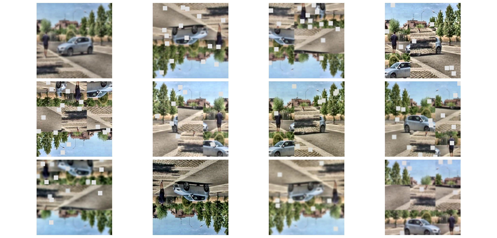

# Vision Transformer Implementation from Scratch
#### This repository demonstrates image classification with Vision Transformers. 
> Refer to ```config.py``` for model related parameters.

```
Folder Structure

>>>> Attention
    - __init__.py
    - attention.py
        + MultiHeadAttention
>>>> Dataset
    - __init__.py
    - dataset.py
        + SmokeDataset
    - utils.py
        + get_train_test()
>>>> Models
    - __init__.py
    - blocks.py
        + FeedForwardBlock
        + ClassificationBlock
>>>> Patches
    - __init__.py
    - patchembedding.py
        + PatchEmbeddings
>>>> Transformers
    - __init__.py
    - transformer.py
        + TransformerEncoder
>>>> Utils
    - __init__.py
    - helper.py
        + TqdmUpTo
        + MetricMonitor
        + calculate_accuracy
    - visualize.py
        + display_image_grid
        + visualize_augmentations
        + plot_curves
    - wrappers.py
        + ResidualAdd
>>>> config.py
>>>> main.py
```

### How to Run

#### 1. Refer to **config.py** for model parameters and configuration

```
num_classes = 1                     ## Number of classes, as this project is a binary classification task
                                    ## By default the value has been set to 1
                                    ## For multiclass, change the value according to number of classes
                                    ## Also, change the criterion accordingly in 'main.py' line no. 90 
```
```
epochs = 20                         ## Number of epochs 
```
```
batch_size = 128                    ## Size of minibatch
```
```
dataset_dir = 'smoke_data/dataset'  ## put the root directory of the dataset here.
                                    ## This directory should contain two subfolders. 
                                    ## One for smoke images and the other for non smoke images.
```
```
resize = True                       ## By deafult the images will be resized. If it's false, 
                                    ## then the model will be trained on default size of the images
                                    ## and the dataset should not contain images of inconsistent size
```
```
num_workers = 4                     
```
```
image_size = (224, 224)             ## Size of the target image after resizing,
                                    ## No color channel info is required.
```
```
pin_memory = True                   ## If the model is training on a cuda enabled device, 
                                    ## then making this True will make the process faster
```
```
device = cuda/cpu                   ## No need to change
```
```

model_name = "ViT"                  ## Careful! its ** ViT **
                                    
```
```

model_path = "path/to/model"        ## the model is saved according to the name and image size
                                    ## In case of some thing else, update it accordingly
                                    ## by default it saves the model in 'saved' folder.

```
```
learning_rate = 0.001               ## 0.001 is the default value of learning rate. Till now,
                                    ## This seems to be the optimal value. Higher values causes fluctuation
                                    ## and lower values causes slower convergence
                                    ## Anything between 0.001~0.005 is good enough
```
```

classification_threshold = 0.75     ## The output of sigmoid function is either
                                    ## <0.1 or >0.9 so the threshold value can be
                                    ## chosen anything between 0.4~0.8.
                                    ## But choosing a higher value reduces false positives 
                                    ## Which can be seen in exceptional cases
```

There are three different transform functions for training, validation and testing. Training process requires heavy image augmentation. Otherwise, there is a tendency of the model to overfit and learn nothing. For the augmentation purpose, albumentations library has been used.
The functions of the training transform are.

```
- CLAHE                             ## Contrast Limited Adaptive Histogram Equalization
                                    ## Used to balance any distortion in the lighting
- Cutout                            ## Creates small squares in the image and fills them with greyish color
                                    ## Significantly increases the accuracy as the model has 
                                    ## a tendecy to identify white garbage as smoke
- Flip                              ## Flips the images randomly either horizontally or vertically
- RGBShift                          ## Randomly shift the value of RGB layers
- RandomFog                         ## Adds a fogginess in the images
                                    ## Improves the generalization of the model
- RandomBrightnessContrast          ## Randomly changes the brightness/contrast of the images

```
All of the transform functions have two things in common. 

```
- Normalization                     ## Normalizes the images
- ToTensorV2                        ## COnverts to tensor
```
  


#### 2. Train
Once the config.py has been updated, the model can be trained by running 
```
python main.py                      ## No extra argument is required

or,

python3 main.py 
```
given that you are already in the project folder.

[Training and Validation Accuracy](images/accuracy.png "Accuracy Curve") 

<center> Fig: Training and Validation Accuracy Curve </center>

 
<center> Fig: Training and Validation Loss Curve </center>
